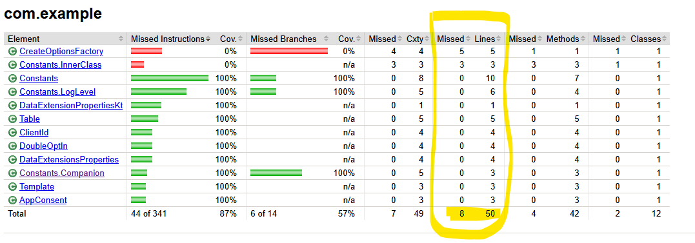
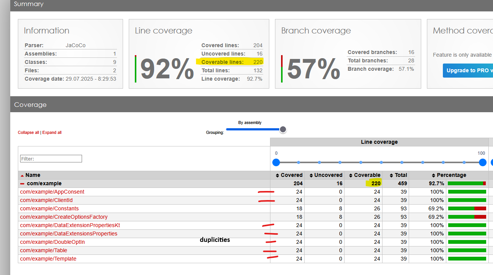

# JaCoCo vs ReportGenerator Kotlin Line Coverage Issue Example

This project demonstrates line coverage percentage differences between [JaCoCo](https://www.jacoco.org/jacoco/) UI and [ReportGenerator](https://github.com/danielpalme/ReportGenerator) when working with Kotlin multiple data classes in the same file.

## Project Details

- **Languages:** Kotlin, Java
- **Build Tool:** Maven

## Purpose

The goal is to showcase how ReportGenerator includes the same line count multiple times, leading to percentage differences when compared to JaCoCo's native HTML reports. 

## How to Use

1. Clone this repository
2. Build the project using Maven:
   ```bash
   mvn clean test jacoco:report
   ```
3. Review the generated JaCoCo coverage report in `target/site/jacoco/index.html`
4. Generate a coverage report using [ReportGenerator](https://github.com/danielpalme/ReportGenerator) from the JaCoCo XML output:
   ```bash
   reportgenerator -reports:"target/site/jacoco/jacoco.xml" -targetdir:"target/reportgenerator" -reporttypes:Html
   ```
5. Observe and compare line coverage results between both reports

## The Issue

ReportGenerator counts the same source lines multiple times when processing JaCoCo XML data, resulting in:

- Higher total line counts in ReportGenerator reports
- Discrepancy coverage percentage compared to JaCoCo UI


## Comparison Example

 Compare the coverage results and total line counts between JaCoCo UI and ReportGenerator to observe the duplicate counting issue.

### Jacoco - the line coverage percentage is (50–8)/50 = 84% 


### ReportGenerator - the line coverage percentage is 92% - same file counted multiple times


## License

MIT